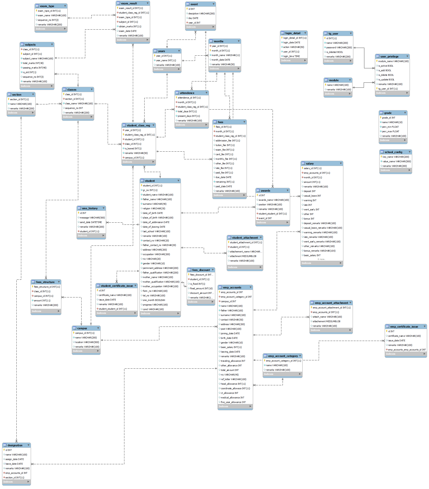

# School Management System (ScMS)

School Management System
The School Management System (ScMS) is a comprehensive desktop-based solution developed to automate administrative tasks, student record-keeping, financial management, and employee payroll for educational institutions. It was specifically designed and implemented for The Guardian School in Hyderabad, Pakistan, to replace manual registration and record-keeping processes.🚀
This software is designed for managing students' and teachers' records, fee payments, class and campus migrations, salary dispatching and other statistical reports. 
<a href="Report.pdf">Detailed Report</a>

# Schema

## Key Features

### 1. Student Management
- **Comprehensive Registration:** Maintains detailed personal, parental, and educational history, including digital attachments like photos and certificates.
- **Enrollment & Search:** Supports enrolling students into specific campuses, sections, and classes. Features a robust search engine with multiple filters (Name, GR No., Session).
- **Attendance Tracking:** Records monthly attendance, including total open days, presence, absence, and leaves.
- **Examination Management:** Configures class-specific course schemes, records marks for various terms/tests, and generates automated mark sheets and ledger reports.
- **Certification:** Issues standardized Leaving Certificates and Character Certificates directly from the system.

### 2. Financial & Fee Management
- **Automated Fee Structure:** Defines fee patterns based on class and campus requirements.
- **Challan Generation:** Bulk generates monthly fee challans for students.
- **Discount & Fixed Fees:** Accommodates special cases, such as students with specific percentage discounts or those on a fixed-fee scholarship.
- **Payment Tracking:** Records paid dates and automatically calculates late fee penalties for payments made after the due date.

### 3. Employee & Payroll Management
- **HR Records:** Manages personal and professional details for teaching and administrative staff, including appointment and service history.
- **Payroll Processing:** Automates monthly salary distribution, calculating bonuses, allowances, and necessary deductions.
- **Document Management:** Stores digital copies of employee qualification records and experience certificates.

### 4. Communication (SMS Gateway)
- **Event Notifications:** Sends automated SMS alerts to parents/students for emergencies, exam schedules, holidays, and fee reminders.
- **Architecture:** Uses the Java Communication API (JCA) to interface with GSM devices via AT Commands.

## 🛠 Tech Stack
- **Programming Language:** Java (Swing for User Interface)
- **ORM Framework:** Hibernate (for managing database entities and objects)
- **Database:** MySQL Server 5.5.34
- **Reporting Engine:** JasperReports (iReport) for high-fidelity document generation
- **IDE:** NetBeans

## 📊 Available Reports
The system utilizes the JasperReport engine to generate various professional documents:
- **Student Reports:** Paid/Unpaid Monthly Challan lists, Defaulter Reports, and Student Contact lists.
- **Academic Reports:** Class Strength Statistical Charts, Mark Sheets, and Attendance Ledgers.
- **Employee Reports:** Appointment Letters, Salary Offer Letters, and Experience Certificates.
- **Financial Reports:** Account Summary (Fee collection vs. Salary/Expenses).

## 🗄️ Database & Tables
The system follows a relational data model with key entities managed via Hibernate:
- **Student:** Core personal and educational data.
- **StudentClassReg:** Tracks enrollment across different academic years.
- **FeesStructure:** Stores class-specific fee amounts.
- **EmpAccount:** Employee profiles and expense categories.
- **SMSHistory:** Logs of all sent notifications.
- **Configuration:** Built-in Database Configuration Wizard to set up Server IP, Username, and Password on initialization.

## ⚙️ System Requirements
- **Processor:** P-IV or faster
- **RAM:** 512 MB minimum
- **Storage:** 512 MB available space
- **Java Runtime:** JDK 1.7
- **Hardware:** GSM Device (for SMS features)

## 📄 Authors
- **Developer:** Jay Kumar
